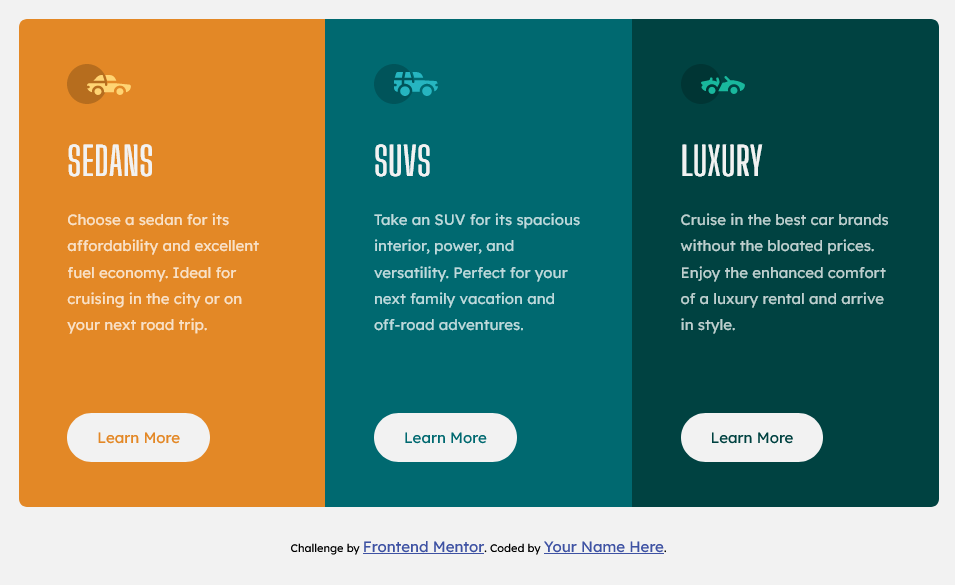
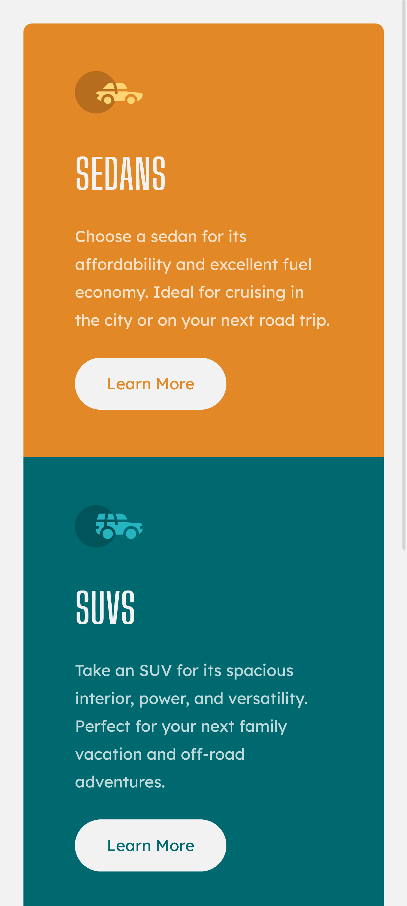

# Frontend Mentor - 3-column preview card component solution

This is a solution to the [3-column preview card component challenge on Frontend Mentor](https://www.frontendmentor.io/challenges/3column-preview-card-component-pH92eAR2-). Frontend Mentor challenges help you improve your coding skills by building realistic projects. 

## Table of contents

- [Overview](#overview)
  - [The challenge](#the-challenge)
  - [Screenshot](#screenshot)
  - [Links](#links)
- [My process](#my-process)
  - [Built with](#built-with)
  - [Useful resources](#useful-resources)
- [Author](#author)

## Overview

### The challenge

Users should be able to:

- View the optimal layout depending on their device's screen size
- See hover states for interactive elements

### Screenshot

Desktop:

Mobile:

### Links

- Solution URL: [Add solution URL here](https://your-solution-url.com)
- Live Site URL: [Add live site URL here](https://your-live-site-url.com)

## My process

### Built with

- HTML5
- CSS Flexbox
- CSS Media Queries
- Mobile-first workflow

### Useful resources

- [MDN](https://developer.mozilla.org/en-US/)
- [Stackoverflow](https://stackoverflow.com/questions)
- [mydevice.io : web devices capabilities](https://www.mydevice.io/)

## Author

- Website - [@nextcorp](https://nextcorp.github.io/)
- Frontend Mentor - [@nextcorp](https://www.frontendmentor.io/profile/nextcorp)
